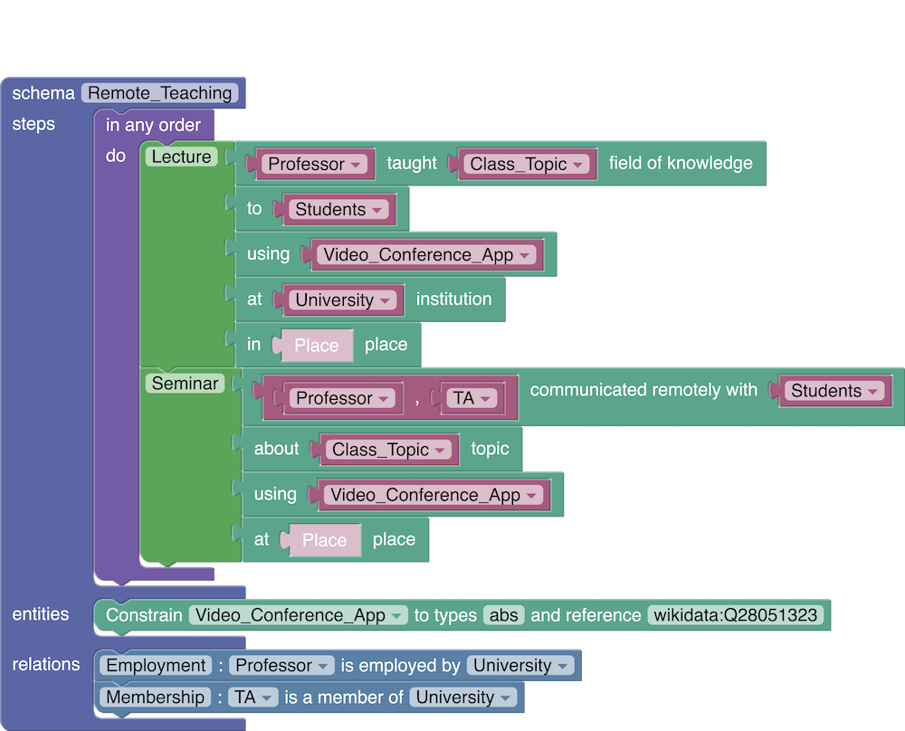

# SchemaBlocks



[Scratch](https://scratch.mit.edu/)-like UI for KAIROS TA1 schema editing. Based on [Google Blockly](https://github.com/google/blockly).

## Using SchemaBlocks to produce KAIROS schemas

Step 1: set up `SchemaBlocks` locally or visit:
[https://sb.retloko.org/](https://sb.retloko.org/)

Step 2: make a schema, e.g. starting from [this example](https://drive.google.com/drive/folders/1BEUp6PMoepLQs-yQu3_bhEdEY1dRCYVa)

Step 3: "export to XML" your schema and save it locally

Step 4: run XML-to-JSON-LD converter (see below)

Step 5: (optional) edit or extend the JSON-LD schema manually

Step 6: validate JSON-LD schema with TA3 validator: [http://validation.kairos.nextcentury.com/](http://validation.kairos.nextcentury.com/)

## Running XML-to-JSON-LD converter

Make sure to use Python>=3.6

Step 1: clone and `cd` into this repo

Step 2: set up your favorite python virtual environment (e.g. virtualenv, conda)

Step 3:
```
cd helpers
pip install -r requirements.txt
python bxml2jsonld.py [xmlpath] [jsonldpath]
```
